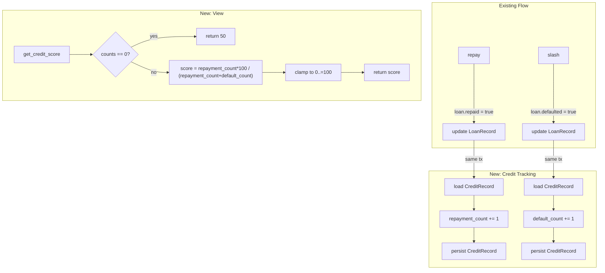

# Design Document: On-Chain Credit Score

## Overview

This feature extends the `QuorumCreditContract` Soroban smart contract with persistent, tamper-proof credit history tracking. Every time a borrower successfully repays a loan or is slashed for a default, the contract increments the corresponding counter in a `CreditRecord` stored in persistent storage. A new `get_credit_score` view function derives a [0, 100] integer score from those counters on demand.

The design is intentionally minimal: no new dependencies, no off-chain oracles, and no changes to the existing `vouch` / `request_loan` flow. The only modifications are to `repay`, `slash`, and the `DataKey` enum, plus the addition of the `CreditRecord` type and the `get_credit_score` function.

---

## Architecture

The feature is entirely self-contained within the single `lib.rs` contract file. There are no new modules or crates required.



---

## Components and Interfaces

### Modified: `DataKey` enum

A new variant is added to the existing `DataKey` enum:

```rust
#[contracttype]
pub enum DataKey {
    Loan(Address),
    Vouches(Address),
    Credit(Address),   // NEW — borrower → CreditRecord
    Admin,
    Token,
    Deployer,
}
```

### New: `CreditRecord` struct

```rust
#[contracttype]
#[derive(Clone, Debug, PartialEq)]
pub struct CreditRecord {
    pub repayment_count: u32,
    pub default_count: u32,
}
```

The `#[contracttype]` derive macro handles XDR serialisation/deserialisation via the Soroban SDK, satisfying the round-trip requirement.

### Modified: `repay`

After setting `loan.repaid = true` and persisting the `LoanRecord`, the function loads (or defaults) the borrower's `CreditRecord`, increments `repayment_count` by 1, and persists it back — all within the same transaction.

### Modified: `slash`

After setting `loan.defaulted = true` and persisting the `LoanRecord`, the function loads (or defaults) the borrower's `CreditRecord`, increments `default_count` by 1, and persists it back — all within the same transaction.

### New: `get_credit_score`

```rust
pub fn get_credit_score(env: Env, borrower: Address) -> u32
```

- Reads `CreditRecord` from persistent storage (defaults to `{0, 0}` if absent).
- If both counts are zero, returns `50`.
- Otherwise computes `(repayment_count * 100) / (repayment_count + default_count)`.
- Clamps the result to `[0, 100]` (the formula is naturally bounded, but the clamp is explicit for safety).
- Does **not** write to storage.

---

## Data Models

### `CreditRecord`

| Field             | Type | Description                                      |
|-------------------|------|--------------------------------------------------|
| `repayment_count` | u32  | Cumulative successful repayments by this borrower |
| `default_count`   | u32  | Cumulative defaults (slashes) by this borrower   |

Storage key: `DataKey::Credit(borrower_address)` in `env.storage().persistent()`.

### Score Formula

```
if repayment_count == 0 && default_count == 0:
    score = 50
else:
    score = (repayment_count * 100) / (repayment_count + default_count)
    score = clamp(score, 0, 100)
```

The formula is integer division (Rust `u32` semantics — truncates toward zero). The result is naturally in [0, 100] because the numerator is at most the denominator × 100, but an explicit `min(score, 100)` guard is included for defensive correctness.

---

## Correctness Properties

*A property is a characteristic or behavior that should hold true across all valid executions of a system — essentially, a formal statement about what the system should do. Properties serve as the bridge between human-readable specifications and machine-verifiable correctness guarantees.*

### Property 1: repay increments repayment_count by exactly 1

*For any* borrower with any prior `repayment_count` value, after a successful call to `repay` (transitioning the loan to `repaid = true`), the borrower's `repayment_count` should be exactly `prior_repayment_count + 1`.

**Validates: Requirements 2.1, 6.1**

### Property 2: slash increments default_count by exactly 1

*For any* borrower with any prior `default_count` value, after a successful call to `slash` (transitioning the loan to `defaulted = true`), the borrower's `default_count` should be exactly `prior_default_count + 1`.

**Validates: Requirements 3.1, 6.2**

### Property 3: Credit score is always in [0, 100]

*For any* borrower address and any combination of `repayment_count` and `default_count` values (including zero), `get_credit_score` must return a value in the inclusive range [0, 100].

**Validates: Requirements 4.1**

### Property 4: Score formula correctness

*For any* borrower with `repayment_count = N` and `default_count = M` where `N + M > 0`, `get_credit_score` must return `(N * 100) / (N + M)` (integer division). When both are zero, it must return 50.

**Validates: Requirements 4.2, 4.3, 4.4, 6.3**

### Property 5: get_credit_score is read-only

*For any* borrower address, calling `get_credit_score` must leave the borrower's `CreditRecord` (and all other contract state) identical to what it was before the call.

**Validates: Requirements 4.5**

### Property 6: Credit record isolation between borrowers

*For any* two distinct borrower addresses A and B, calling `repay` or `slash` for borrower A must leave borrower B's `CreditRecord` unchanged.

**Validates: Requirements 5.1, 5.2**

### Property 7: Counter monotonicity

*For any* borrower, after any sequence of `repay` and `slash` calls, `repayment_count` must be greater than or equal to its value before the sequence, and `default_count` must be greater than or equal to its value before the sequence. Neither counter ever decreases.

**Validates: Requirements 6.1, 6.2**

### Property 8: CreditRecord round-trip serialisation

*For any* valid `CreditRecord` value (any `u32` pair), writing it to persistent storage and reading it back must produce a `CreditRecord` with identical `repayment_count` and `default_count` fields.

**Validates: Requirements 7.1, 7.2**

---

## Error Handling

| Scenario | Existing behaviour | Credit score impact |
|---|---|---|
| `repay` called on already-repaid loan | `assert!(!loan.repaid)` panics | `repayment_count` unchanged (panic before increment) |
| `repay` called on defaulted loan | `assert!(!loan.defaulted)` panics | `repayment_count` unchanged |
| `slash` called on already-defaulted loan | `assert!(!loan.defaulted)` panics | `default_count` unchanged |
| `slash` called on repaid loan | `assert!(!loan.repaid)` panics | `default_count` unchanged |
| `get_credit_score` for unknown borrower | No error — returns 50 | N/A (read-only) |

No new error variants are needed. The existing `assert!` guards in `repay` and `slash` already prevent double-counting by aborting the transaction before the credit record update is reached.

---

## Testing Strategy

### Dual Testing Approach

Both unit tests and property-based tests are required. Unit tests cover concrete examples and error conditions; property tests verify universal correctness across randomly generated inputs.

### Unit Tests (additions to existing `#[cfg(test)]` module)

- `test_repay_increments_repayment_count` — repay once, assert `repayment_count == 1`.
- `test_slash_increments_default_count` — slash once, assert `default_count == 1`.
- `test_get_credit_score_no_history` — fresh borrower returns 50.
- `test_get_credit_score_all_repaid` — N repayments, 0 defaults → score == 100.
- `test_get_credit_score_all_defaulted` — 0 repayments, M defaults → score == 0.
- `test_get_credit_score_mixed` — known N and M → verify formula result.
- `test_repay_twice_does_not_double_count` — second repay panics; count stays at 1.
- `test_slash_twice_does_not_double_count` — second slash panics; count stays at 1.
- `test_credit_record_isolation` — repay for borrower A, verify borrower B's record is unchanged.
- `test_get_credit_score_is_readonly` — call `get_credit_score`, verify no storage mutation.

### Property-Based Tests

The property-based testing library is **`proptest`** (crate `proptest = "1"`), added as a `[dev-dependency]`. Each test runs a minimum of **100 iterations**.

Each test is tagged with a comment in the format:
`// Feature: on-chain-credit-score, Property <N>: <property_text>`

| Test name | Property | Iterations |
|---|---|---|
| `prop_repay_increments_repayment_count` | Property 1 | 100 |
| `prop_slash_increments_default_count` | Property 2 | 100 |
| `prop_score_always_in_range` | Property 3 | 100 |
| `prop_score_formula_correctness` | Property 4 | 100 |
| `prop_score_is_readonly` | Property 5 | 100 |
| `prop_credit_record_isolation` | Property 6 | 100 |
| `prop_counter_monotonicity` | Property 7 | 100 |
| `prop_credit_record_round_trip` | Property 8 | 100 |

For Properties 1, 2, 6, and 7, the test harness sets up a fresh `Env`, registers the contract, and generates random borrower addresses and stake amounts. For Properties 3 and 4, the score computation function is extracted into a pure helper (`compute_score(r: u32, d: u32) -> u32`) that can be tested without a full contract environment. For Property 8, `proptest` generates arbitrary `(u32, u32)` pairs, constructs a `CreditRecord`, writes it to a test `Env`'s persistent storage, reads it back, and asserts equality.
