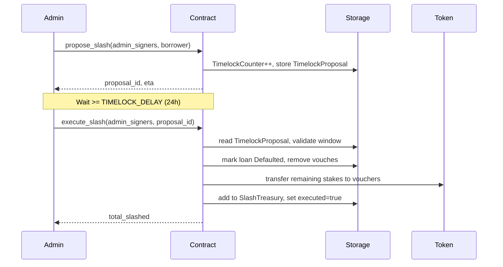
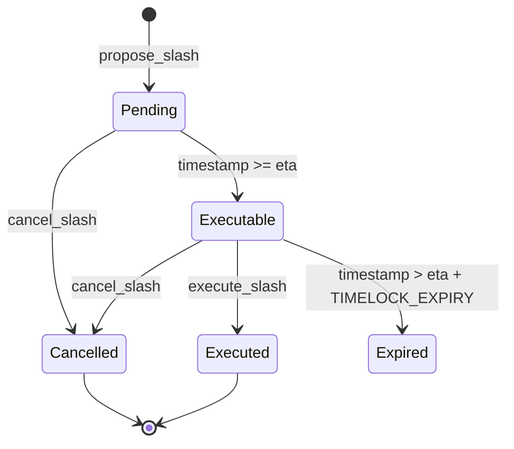

# Design Document: Timelock on Admin Slash Operations

## Overview

This feature wires the existing `TimelockProposal` / `TimelockAction::Slash` infrastructure (already defined in `types.rs`) into the admin slash flow. Instead of slashing immediately, admins must first call `propose_slash`, wait at least `TIMELOCK_DELAY` (24 h), then call `execute_slash`. A `cancel_slash` escape hatch lets admins retract a proposal before execution.

The existing `slash` function in `lib.rs` is **not removed** — it remains available for emergency use. The new timelock path is the recommended default for non-emergency slashes.

## Architecture



### State Machine for a Slash Proposal



## Components and Interfaces

### New public functions (added to `lib.rs` / `admin.rs`)

```rust
/// Propose a timelock-guarded slash against a borrower.
/// Returns the new proposal_id.
pub fn propose_slash(
    env: Env,
    admin_signers: Vec<Address>,
    borrower: Address,
) -> Result<u64, ContractError>

/// Execute a previously proposed slash after the delay has elapsed.
pub fn execute_slash(
    env: Env,
    admin_signers: Vec<Address>,
    proposal_id: u64,
) -> Result<(), ContractError>

/// Cancel a pending slash proposal.
pub fn cancel_slash(
    env: Env,
    admin_signers: Vec<Address>,
    proposal_id: u64,
) -> Result<(), ContractError>

/// Query a slash proposal by ID.
pub fn get_slash_proposal(
    env: Env,
    proposal_id: u64,
) -> Option<TimelockProposal>
```

### Storage keys used (all pre-existing in `types.rs`)

| Key | Type | Purpose |
|-----|------|---------|
| `DataKey::TimelockCounter` | `u64` | Monotonically increasing proposal ID |
| `DataKey::Timelock(proposal_id)` | `TimelockProposal` | Proposal state |

### Types used (all pre-existing in `types.rs`)

```rust
pub struct TimelockProposal {
    pub id: u64,
    pub action: TimelockAction,
    pub proposer: Address,
    pub eta: u64,
    pub executed: bool,
    pub cancelled: bool,
}

pub enum TimelockAction {
    Slash(Address),
    SetConfig(Config),
}
```

### Config extension

`Config` in `types.rs` needs two new optional fields:

```rust
pub struct Config {
    // ... existing fields ...
    pub timelock_delay: u64,   // 0 = use TIMELOCK_DELAY constant (86400)
    pub timelock_expiry: u64,  // 0 = use TIMELOCK_EXPIRY constant (259200)
}
```

Helper to resolve effective delay:

```rust
fn effective_timelock_delay(cfg: &Config) -> u64 {
    if cfg.timelock_delay > 0 { cfg.timelock_delay } else { TIMELOCK_DELAY }
}

fn effective_timelock_expiry(cfg: &Config) -> u64 {
    if cfg.timelock_expiry > 0 { cfg.timelock_expiry } else { TIMELOCK_EXPIRY }
}
```

## Data Models

### Proposal lifecycle fields

| Field | Set at | Value |
|-------|--------|-------|
| `id` | `propose_slash` | next `TimelockCounter` value |
| `action` | `propose_slash` | `TimelockAction::Slash(borrower)` |
| `proposer` | `propose_slash` | first element of `admin_signers` |
| `eta` | `propose_slash` | `env.ledger().timestamp() + effective_delay` |
| `executed` | `propose_slash` / `execute_slash` | `false` / `true` |
| `cancelled` | `propose_slash` / `cancel_slash` | `false` / `true` |

### Execution window

```
proposal.eta  <=  current_timestamp  <=  proposal.eta + TIMELOCK_EXPIRY
```

If `current_timestamp < proposal.eta` → `TimelockNotReady`
If `current_timestamp > proposal.eta + TIMELOCK_EXPIRY` → `TimelockExpired`

## Correctness Properties

*A property is a characteristic or behavior that should hold true across all valid executions of a system — essentially, a formal statement about what the system should do. Properties serve as the bridge between human-readable specifications and machine-verifiable correctness guarantees.*

---

**Property 1: Proposal storage round-trip**
*For any* valid `propose_slash` call (active loan, sufficient signers), the proposal stored under `DataKey::Timelock(proposal_id)` must have `eta = timestamp_at_call + effective_delay`, `executed = false`, `cancelled = false`, and `action = TimelockAction::Slash(borrower)`.
**Validates: Requirements 1.1, 1.3**

---

**Property 2: Proposal ID monotonicity**
*For any* sequence of N successful `propose_slash` calls, the returned proposal IDs must be strictly increasing and each must equal the previous counter value plus one. Multiple proposals for the same borrower must each receive a distinct ID.
**Validates: Requirements 1.2, 1.8**

---

**Property 3: Insufficient signers are rejected**
*For any* call to `propose_slash` or `cancel_slash` where the number of provided admin signers is less than `Config.admin_threshold`, the contract must return an error and leave storage unchanged.
**Validates: Requirements 1.5, 3.6**

---

**Property 4: Proposal requires active loan**
*For any* borrower address that does not have an active loan, calling `propose_slash` must return `NoActiveLoan` and must not create a proposal or increment the counter.
**Validates: Requirements 1.6**

---

**Property 5: Execute slash success invariants**
*For any* proposal in the executable window (`eta <= now <= eta + TIMELOCK_EXPIRY`), a successful `execute_slash` must: (a) set `proposal.executed = true`, (b) mark the borrower's loan as `Defaulted`, (c) increment `DefaultCount(borrower)` by exactly 1, and (d) add the slashed amount to `SlashTreasury`.
**Validates: Requirements 2.1, 2.11**

---

**Property 6: TimelockNotReady guard**
*For any* proposal where `current_timestamp < proposal.eta`, calling `execute_slash` must return `TimelockNotReady` and leave the proposal and loan state unchanged.
**Validates: Requirements 2.4**

---

**Property 7: TimelockExpired guard**
*For any* proposal where `current_timestamp > proposal.eta + TIMELOCK_EXPIRY`, calling `execute_slash` must return `TimelockExpired` and leave the proposal and loan state unchanged.
**Validates: Requirements 2.5**

---

**Property 8: Cancel sets cancelled flag**
*For any* pending (not executed, not cancelled) proposal, a successful `cancel_slash` must set `proposal.cancelled = true` and must not modify the borrower's loan state.
**Validates: Requirements 3.1**

---

**Property 9: Cancelled proposal cannot be executed**
*For any* proposal where `cancelled = true`, calling `execute_slash` must return `InvalidStateTransition` regardless of the current timestamp.
**Validates: Requirements 2.7**

---

**Property 10: Configurable timelock parameters**
*For any* `Config` with a non-zero `timelock_delay` value D, a `propose_slash` call must set `eta = current_timestamp + D`. Similarly, *for any* non-zero `timelock_expiry` value E, `execute_slash` must use E as the expiry window.
**Validates: Requirements 5.1, 5.2**

## Error Handling

All error codes are pre-existing in `errors.rs`:

| Condition | Error |
|-----------|-------|
| Signer count < threshold | `UnauthorizedCaller` (via `require_admin_approval` panic) |
| Borrower has no active loan | `NoActiveLoan` |
| Proposal ID not found | `TimelockNotFound` |
| `now < eta` | `TimelockNotReady` |
| `now > eta + expiry` | `TimelockExpired` |
| `proposal.executed == true` | `SlashAlreadyExecuted` |
| `proposal.cancelled == true` | `InvalidStateTransition` |
| Contract paused | `ContractPaused` |

No new error codes are needed.

## Testing Strategy

### Dual approach

**Unit tests** (in `src/timelock_slash_test.rs`) cover:
- Happy path: propose → wait → execute
- Happy path: propose → cancel
- `TimelockNotFound` on unknown proposal ID
- `TimelockNotReady` when executed too early
- `TimelockExpired` when executed too late
- `SlashAlreadyExecuted` on double-execute
- `InvalidStateTransition` on execute-after-cancel and cancel-after-cancel
- `NoActiveLoan` when borrower repays between propose and execute
- Reputation NFT burn on execute
- `DefaultCount` increment on execute

**Property-based tests** use the `soroban-sdk` test environment with randomized inputs. Since Soroban's test framework does not include a dedicated PBT library, properties are implemented as parameterized tests with multiple generated scenarios using Rust's standard `rand` crate in `dev-dependencies`, running at least 100 iterations each.

Each property test is tagged with a comment:
```
// Feature: timelock-admin-slash, Property N: <property_text>
```

### Property test configuration

- Minimum 100 iterations per property
- Randomize: borrower addresses, stake amounts, admin signer subsets, timestamp offsets
- Use `env.ledger().set_timestamp(t)` to simulate time passage in tests
